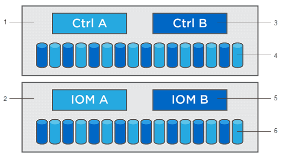

= Actualizaciones de software y firmware de la controladora
:allow-uri-read: 
:experimental: 
:icons: font
:imagesdir: ../media/

[role="lead"]
Es posible actualizar el software y el firmware de la cabina de almacenamiento para obtener todas las funciones y las correcciones de errores más recientes.

== Componentes que se incluyen en la actualización de software de la controladora de un sistema operativo SANtricity

Varios componentes de la cabina de almacenamiento contienen software o hardware que puede ser conveniente actualizar de vez en cuando.

* *Software de gestión* -- System Manager es el software que administra la matriz de almacenamiento.
* *Firmware de la controladora* -- el firmware de la controladora administra las E/S entre hosts y volúmenes.
* *NVSRAM de controladora* -- NVSRAM de controladora es un archivo de controladora que especifica las configuraciones predeterminadas para las controladoras.
* *Firmware del IOM* -- el firmware del módulo de I/o (IOM) administra la conexión entre una controladora y una bandeja de unidades. Además, supervisa el estado de los componentes.
* *Software de supervisor* -- Software de supervisor es la máquina virtual en un controlador en el que se ejecuta el software.

Bandeja de controladoras esta 1; bandeja de unidades esta 2; software de esta versión 3, firmware de la controladora, NVSRAM de la controladora, Software de supervisor; firmware de la unidad de esta 4; firmware de esta 5 IOM; firmware de la unidad de esta versión 6

Puede ver las versiones de software y firmware actuales en el cuadro de diálogo *Inventario de software y firmware*. Vaya al menú:Soporte[Centro de actualización] y, a continuación, haga clic en el vínculo *Inventario de software y firmware*.

Como parte del proceso de actualización, es posible que el controlador de conmutación al nodo de respaldo/multivía del host o el controlador de HBA también deban actualizarse para que el host pueda interactuar con las controladoras correctamente. Para determinar si este es el caso, consulte https://imt.netapp.com/matrix/#welcome["Herramienta de matriz de interoperabilidad de NetApp"^].

== Cuándo detener las operaciones de I/O.

Si la cabina de almacenamiento contiene dos controladoras y existe un controlador multivía instalado, la cabina de almacenamiento puede seguir procesando las operaciones de I/o mientras se realiza la actualización. Durante la actualización, la controladora A conmuta todos los volúmenes a la controladora B, se actualiza, retira todos sus volúmenes y los de la controladora B, y después actualiza la controladora B.

== Comprobación del estado previa a la actualización

Como parte del proceso de actualización, se ejecuta una comprobación del estado previa a la actualización. La comprobación del estado antes de la actualización evalúa todos los componentes de la cabina de almacenamiento para garantizar que se pueda proceder con la actualización. Las siguientes condiciones podrían evitar la actualización:

* Unidades asignadas con errores
* Piezas de repuesto en uso
* Grupos de volúmenes incompletos
* Operaciones exclusivas en ejecución
* Volúmenes faltantes
* Estado no óptimo de la controladora
* Cantidad excesiva de eventos en el registro de eventos
* Fallo de validación de la base de datos de configuración
* Unidades con versiones de DACstore anteriores

También se puede ejecutar la comprobación del estado antes de la actualización en forma independiente, sin realizar una actualización.
